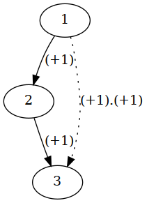
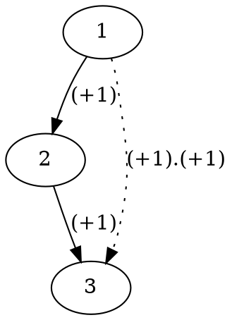
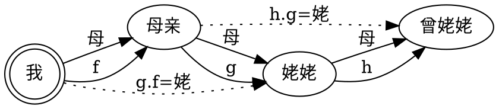
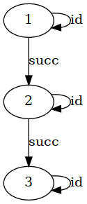
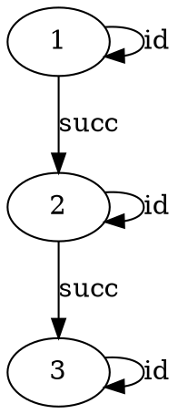

# 咱来谈谈范畴论

> 真正的无知不是知识的匮乏，而是拒绝获取知识；真正的理解也不是能懂得或者能造出晦涩难懂的知识，而是能把晦涩难懂的知识讲得通俗易懂。

当然即便很有可能不准确，聊胜于无，说这个话题的中文文章不多，最知名的比如阮老师的那篇 [FP入门](http://www.ruanyifeng.com/blog/2017/02/fp-tutorial.html)。

当然也可以去看看进阶版本的那个[装逼指南](https://blog.oyanglul.us/grokking-monad/part1)。

当然数学爱好者可以去看看 _抽象代数_，我一朋友写的博客[在这里](https://lexuge.github.io/posts/abstract-algebra-learning-log-preliminaries/)。

这篇文章受限于作者的水平 ~~也包括一些刻意设计~~ 难度大概在阮老师和装逼指南版本之间，当然还是偏向阮老师那篇的。

这里我们讲的是纯范畴论，和函数式编程 ~~关系不大~~，所以不要提什么纯函数、副作用、引用透明、惰性求值、高阶函数之类的。

范畴论<sub>(category theory)</sub>是什么呢…… 这个问题在提出来之前，肯定大家都得先膜拜一下那些[Haskell](https://www.haskell.org/)大佬吧，可惜我不是，这真是一个悲伤的故事。

不过我今天不是来谈Haskell的，我一定不会用到数量过多的Haskell语法和概念，不过很有可能会曲解很多概念，毕竟其实我也不懂，只是为了大家装逼特意过来发福利而已。~~请大家放心，其实错了也不妨碍你们装逼的。~~

这篇文章假定你没有任何Haskell功底，也只会教你和入门范畴论基本理念相关的语法，[入门请看这里](#haskell-intro)。

历史上的东西，我们就不谈了，毕竟也比较好找，详情 [wikipedia:Category theory](https://en.wikipedia.org/wiki/Category_theory)。

## 一般的命名约定

+ 对范畴论，`a b c` 都是对象、`f g h` 都是箭头。
+ 对Haskell，`a b c` 都是类型、`x y z` 都是值、`f g h` 同上。

## 含宏半群<sub>(Monoid)</sub>

范畴<sub>(Category)</sub>有两个组成成分：对象<sub>(Object)</sub>和箭头<sub>(Morphism, 态射)</sub>。

一个范畴其实也可以视作对象的集合，毕竟一般来讲箭头 `f: (a -> b)` 都是用于修饰对象，来描述另一个对象的，即便它也可以被用来做计算，毕竟函数式做计算都是 _分支函数_ 和 _递归_。

下文中尤其注意要把 Haskell 的类型变量 `a b` 和范畴论的对象 `a b` 分开，不要认为 `a b` 和它们的类型有关……

当然集合也是分 _有穷_<sub>(finite)</sub>和 _无穷_ 的，但给一个对象你都可以判断它是否属于某个集合。

Semigroup 就是满足这两个性质的 Category ~~Set _集合_~~：

+ closure<sub>封闭律</sub>: `forall f g. exists h. h x = f (g x)`
+ associative<sub>结合律</sub>: `forall f g h. (f.g).h = f.(g.h)` ~~其实是 `(.)` closure运算的结合律~~

其中 `(f.g)` 就是表达一个 `h` _where_ `h x = f (g x)`





```bash
dot -Tpng ints.gv -o ints.png
```

其中那两个 `(+1)` 从上往下分别叫 `f`, `g`；而 `(+1).(+1)` 是它们的 _合成_<sub>(composition)</sub>，也是一个箭头，叫 `h`。（按一般约定会这么叫）

一般来讲为了理论的优雅性，大部分文章里 1, 2, 3 都被泛化为了 X, Y, Z（数学风格里单大写字母表示常量）。

这个 X, Y, Z 可能是人、花草、事物…… 以及一切范畴里的一切对象，只要它上面的箭头映射到同一个范畴（比如 __人__ 的母亲是人、__人__ 的父亲是人、__事物__ 在物理上的最近邻仍是事物）就可以随便组合（比如，『你妈妈(f)的妈妈(g)』或者说『你的姥姥(h)』）。

至于那个结合律，一般认为是可以直接从定义导出的性质，当然前提是肯定等价，没有副作用。



嗯，「女老」就是姥姥嘛，__我__ 的姥姥和 __母亲__ 的姥姥都是 `母 . 母`，`(f . g) . h = f . (g . h)`，就是说「姥姥的妈」和「妈的姥姥」一样。 ~~怎么感觉有点奇奇怪怪的~~

Monoid 就是满足这个性质的 Semigroup：

+ identity: `exists id. forall a. id a = a`





本节的最后我想告诉你，__其实本文说的『范畴』都是指 _Monoid_ 而不是我上面定义的 _Category_，那只是 _directed graph_<sub>有向图</sub> 而已__。至于为什么我要出尔反尔，那是因为我从 __五个人那里听到过五种不同的定义__，我实在是有点迷糊了，搞不明白到底谁对谁错，以及范畴论到底是做甚么的，所以只好把 _搞清楚_ 到底哪个是真正定义的 _艰巨_ 任务交给读者们完成了。也是无所谓，一千个读者眼里有一千个哈姆雷特，你们开心就好。

## Nat 是啥子

Nat 是自然数<sub>(natural number)</sub>的意思。

自然数的定义，一个是我们数学上那个『大家都明白』的简易模式识别版本（就是给正常人学的版本），我们知道上面可以进行四则运算，可是它和范畴有啥关系呢？

这里我们把自然数视为 _0_，或 _另一个自然数+1_，因为1是自然数的 _基本单位_，所有自然数均由1或0累积构成。

```haskell
data Nat = Z {-Zero-}| S Nat {-Succeeder-}

succ = (S :: Nat -> Nat) -- plus one
succ :: Nat -> Nat

pred n@(S m1) = m1 -- minus one
pred :: Nat -> Nat
```

可是它和范畴有啥关系呢？

```haskell
plus :: Nat -> Nat -> Nat -- (->) 是「右结合」的，这等价 Nat -> (Nat -> Nat)
plus Z n = n -- (n+0) = n
plus x n = plus (pred x) (succ n) -- (n+x) = (n+1)+(x-1)
```

虽然我们的抽象是这样的，定义也细致了很多，但它也是符合数学上自然数定义的。


```tex
(+)::a\to(a\to a)
```

Haskell 的中缀运算符是直接支持 `(1+1)=2` 这种模式匹配定义形式的，但是也有反括号 __中缀式调用__ 一个函数：(0 \`plus\` 2) = (\`plus\` 2) 0


```tex
plus = \begin{cases}
  0\to&id \begin{cases} 0\to{0}\\ 1\to{1} \\ \cdots\end{cases} \\
  1\to&succ.id \begin{cases} 0\to{1}\\ 1\to{2} \\ \cdots\end{cases} \\
  2\to&succ.(plus\quad 1) \begin{cases} 0\to{2}\\ 1\to{3} \\ \cdots\end{cases} \\
  \cdots
\end{cases}
```

```haskell
plus :: Nat -> (Nat -> Nat)
plus Z = id
plus x = ((plus . pred) x) . succ
```

嗯。_函数_<sub>(function)</sub> 是一种 _映射关系_<sub>(mapping)</sub>，而不是一种 _子程序_<sub>(subroutine)</sub>，这是数学函数、纯函数式编程。

不过呢 _映射_ 是一种 _单向关系_，所以这么写的程序按上面那个梗（姥姥是妈妈的妈妈），给它「你的姥姥」是算不出「你」的，只能得到你的「妈妈的妈妈的妈妈的妈妈」也就是你的「太姥姥」，哈哈。

这里没有状态——不要当它存在、没有什么新不新旧不旧、放置和取出，就是一个个对象和不断映射它们的映射关系，分支函数实现「条件」、递归函数实现「循环」，权当你之前为了理解所作的变通，通通不存在。

模型本身并不很难理解，多琢磨一下几个小例子就了解了。

所以Haskell的 guard（分支）函数、`case of`、基于模式匹配定义的函数不是为了好看，而是它们本来就是那样而已。

所以Haskell的IO很难做不是为了实现惰性计算甚至线程安全，而是因为Haskell生来如此，设计就是纯的函数式编程。

`Nat` 的的箭头比如 `(plus 1 :: Nat -> Nat)`，`Nat` 的对象就多了，`Z`、`two = (succ (succ Z))` 都是。

然后你会发现怎么形式化语言的 [terminal 和 non terminal](#formal-language) 像是范畴里的对象和箭头呢？

那么如果有函数 `(show :: Nat -> String)` 呢？这就是要用到一个 __更大的范畴__ 上的 _箭头_ `(->) :: (* -> *)`，一个 _Higher Kind_<sub>类型种属</sub>，其中 `*` 是任一 Haskell 类型——_Haskell 类型系统范畴_ 上的 _对象_，而这个大范畴视作集合，是所有 Haskell 类型的 _并集类型_<sub>(union type)</sub>。

比如，`(->)` 的那个范畴上就有一个箭头 `id :: forall a. a -> a` 和 `(.) :: forall a b c. (b -> c) -> (a -> b) -> (a -> c)`，注意这里的 _a_, _b_, _c_ 代表类型或者说 Haskell 类型系统范畴上的对象。

默认类型变量都是隐式声明的。显示写出 `forall` 也是可以的，不过需要开启 `{-# LANGUAGE RankNTypes #-}`，这其实是一个类型系统上的语言特性（顺便也可以去看看 `LANGUAGE GADTs`，广义代数数据类型<sub><a href="https://en.wikibooks.org/wiki/Haskell/GADT"><i>Generalized algebraic datatypes</i></a></sub>）。

```haskell
class (k :: * -> *) => Category k where
  id :: k a a
  (.) :: k b c -> k a b -> k a c

type HaskType = (->) :: * -> *
instance Category HaskType where
  id = id :: a -> a
  (f . g) = \x -> f ((g x) :: b) {- a -> c -}
```

当然这样就产生了递归（准确的说是我们发现了，因为Haskell里始终就有……），就产生了许多许多更高维度（比如，对象是 `(->)`）的范畴…… 这里都不讨论。

当然 `(->)` 并不是一个特殊的语法，它只是 Haskell Higher Kinds 的一个 _类型构造器_<sub>(type constructor)</sub> 而已，注意不是 _数据构造器_……

```haskell
(->) :: TYPE q -> TYPE r -> *
```

那么此箭头在不在 `Nat` 范畴上呢？不在，因为我们知道任何 `String` 对象都不可能是 `Nat` 对象，它们之间不存在 _实际上_ 的 _交集_<sub>intersection</sub>，而箭头 `f: (a -> b)` 里 _a_, _b_ 需属同一范畴，所以这只能是 `(String & Nat)` 也就是（交集）`*` 上的箭头。

## 瞎想 Nat

想要有个基于 Nat 的 Int，就是有 _符号_ 或者说正负的 Nat。

```haskell
class Equiv t t' where
  from :: t -> t'
  to :: t' -> t

-- Int和Nat本不等价，教学目的，不准瞎复制。
instance Equiv Int Nat where
  from i = if i >= 0 then (foldnl suc Z i) else undefined where
    suc = (\n _ -> S n) -- flip (\_ -> S)
  to Z = 0
  to x = 1 + (to . pred) x

foldnl :: (b -> Int -> b) -> b -> (Int -> b)
foldnl f v = \n -> (foldl f v) [1..n]
```

首先可以有一个弱智一点的。

```haskell
newtype BadInt' = BadInt' (Bool{-neg?-}, Nat)

instance Equiv Int BadInt' where
  from i = (i < 0, from . abs i)
  to (s, x) = let sign = (if s then negate else id) in
    (sign . to) x
```

弱智不是因为它很直白，而是因为它的直白导致了存在 `+0` 和 `-0` 区分这种窘况……

为了保证 _0_ 被良好区分开，我们认为要把负数和自然数（正数和零）的部分有一个划分。

`forall n, x in Nat. n+(-x) < 0 => max(x)`

来找到第一个绝对的加法负数因子 `x=1`，又因为 `forall a b. a-b = a+(-b)`，而且 `0-1` 又被称为 `minus 1`/`negative 1`，所以

```haskell
data Int' = P Nat | N1m Nat {- -1-x | -(1+x) -}

instance Equiv Int Int' where
  from i = if i >= 0 then (P . from) i
    else (N1m . from . abs . (subtract (-1))) i
  to (P x) = to x
  to (N1m x) = -(1 + to x)
```

## Functor<sub>函子</sub> 们


```haskell
class (Category c, Category d) => Functor c d t where
  fmap :: c a b -> d (t a) (t b)
```

图是从 [这里](https://blog.oyanglul.us/grokking-monad/part1#orgc8c5e99) ~~盗~~ 过来的，我懒得再画一遍了。

自函子<sub>(endofunctor)</sub>就是连接相同范畴的 functor。

```haskell
type Endofunctor c t = Functor c c t
```

然后我曾经听到有人说『Monad<sub>单子</sub> 就是自函子范畴上的含宏半群』是什么鬼，大概意思应该是 Monad 是含宏半群上的 Functor 吧。

当然我是不了解的，据说 Monad：

+ 是 `Endofunctor t`
+ 上面有 `(eta :: a -> t a)`（id<sub>c</sub> 到 T）、`(mu :: t t a -> t a)`（T T 到 T）

一般的用法就是 `eta` 拿来把一 `(t a)` 变成 `(t t a)` 然后 `mu` 弄回去，当然我是指不学术上的。

为什么它这么难呢？因为所有被构筑不是为了来解决实际问题的理论都是很难的，要不然你的智商余下一大把，体验不到挑战脑力的快感，也就使得这种理论事实上没有意义了。 ~~虽然它们可能本来就很没有意义~~

所以为什么要有 `Functor`，模拟变量或者说『盒子』的解释也未必不可（虽然那只是很小一个用法而已）。

没有 `(get :: Functor t -> t)` 是因为要使这种函数有意义，就必须再配上一个 `(set :: Functor t -> t -> Unit)`，不然『只能取』在惰性求值的Haskell里等价于 `t` 本身，Haskell从不是这样，自设计以来就不是。 ~~虽然我好像也没有立场以这种语气说什么Haskell不Haskell~~

这个世界是无状态的，只由「对象描述(初始、或由态射组合而成的)」和「态射修饰」组成计算。
大家觉得Functor像盒子是因为它的确蕴存了『状态』，它「包住」了一个范畴，也就是某种可能的『取值』对象，理论上也可以说是所有的，只不过所有类似初始对象的东西都被箭头们修饰过了，根本没区别。

`Functor` 范畴上面的态射也可以通过 `(fmap :: (Functor t) => (a -> b) -> (t a -> t b))` 来包住: `(fmap (plus 1)) :: Functor Int -> Functor Int`，要不然你怎么在 `Functor` 上执行计算？因为 `(fmap f fct)` 就可以把『盒子』里的东西交给 `f` 处理然后放回去？从来就没有一个能够『放置』的盒子。

所以你听我说完以后再去看 [某图](#functor-g1) 是不是莫名觉得很正常一样呢。

这张是不是更正常呢？ ~~好吧一点也不~~


至于它到底有没有包住一个范畴的，其实包住「取值」就是包住范畴了，毕竟我们认为每一个「箭头」都对所有可能的对象产生了映射动作。在 `Nat` 的例子里，`Nat` 类型有一个无递归架构器，数据对象 `(Z :: Nat)`，也可能有除了 `(S :: Nat -> Nat)` 的箭头，可是只要 `Functor` 包住了某个 `Nat`，接受它的箭头都会正确映射当前组合修饰出的对象到其他对象，换句话说就是等于包住了整个范畴。

不要以『状态转移』的思路对付Haskell，会很奇怪的。

最后自然就是一些 JavaScript 的『函子』了，这是方便你们学习， __我不是盗的、我不是盗的、我不是盗的。__

两种语言是为了尽可能减少思维僵 ~~江~~ 化。

就有一个 `Functor`，我们认为它什么都不做只是以 `f` 修饰内部范畴。

```javascript
function ctorRef(ctor) { return (...cargs) => new ctor(...cargs); }

class Functor {
  constructor(x) { this.x = x; }
  map(f) { return Functor.of(f(this.x)); }
}
Functor.of = ctorRef(Functor);
Functor.of("em").map(s => s+"mm").map(console.log);
```

```haskell
newtype Identity t = { {-key-}runIdentity :: t{-key's type-} }
{- Equiv t (Identity t) -}
Identity :: t -> (Identity t) -- from
runIdentity :: (Identity t) -> t -- to

runIdentity (Identity 1) -- 1

instance Functor (Identity :: * -> *) where
  fmap f x = Identity (f (runIdentity x))
  {- fmap f (Identity x) = Identity f x -}
instance Monad (Identity :: * -> *) where
  return x = Identity x
  (x >>= f) = f (runIdentity x)
  {- (Identity x >>= f) = f x -}
```

友情提示：大括号 `{--}` 里的模式匹配解构版本更好看。

不会？一脸蒙蔽？没关系，多看几遍就好了，幼稚园级别我至少蒙蔽了两周。

因为可以方便地抄代码我就又[抄](https://blog.oyanglul.us/grokking-monad/part2)了个 Scala 的版本

不过 Scala 没有 Typeclass，所以要用 `implicit val` 隐式转化（注意 Scala 里泛型是方括号）。

```scala
case class Identity[A](run: A)

Identity(1).run // 1

implicit val identityFunctor: Functor[Identity] = new Functor[Identity] {
  def fmap[A, B](f: A => B): Identity[A] => Identity[B]
    = { case Identity(x) => Identity(f(x)) }
}

implicit val identityMonad: Monad[Identity] = new Monad[Identity] {
  def pure[A](x: A): Id[A] = Identity(x)
  def flatMap[A, B](f: A => Identity[B]): Identity[A] => Identity[B]
    = { case Identity(x) => f(x) }
}
```

还有 `Maybe`，我们认为它就是 Kotlin 的 `(x?.let)` _where_ `x: T? <T: Any>`

```javascript
class Maybe {
  constructor(x) { this.x = x; }
  static of(x) { return new Maybe(x); }
  map(f) { if (this.x ==null) return this;
    else return Maybe.of(f(this.x)); }
}
Maybe.None = Maybe.of(null);

const w = _ => console.log('w');
Maybe.None.map(w);
Maybe.of(1).map(w); //w
```

```haskell
import Prelude hiding (Maybe, Just, Nothing)

data Maybe t = Just t | Nothing

instance Functor Maybe where
  fmap f Nothing = Nothing
  fmap f (Just x) = Just (f x) -- apply and "wrap"

main = do
  --((\_ -> putStrLn ":/") <$> Nothing)
  -- 大家可以看到它是 Maybe IO (), 要 Alternative 很麻烦，算了
  case (print . (+1)) <$> (Just 1) of
    (Just r) -> r
```

其中 `f <$> fct` 就是 `fmap` 的中缀版本。

```scala
trait Maybe[+T]
case class Some[T](x: T) extends Maybe[T]
case object None extends Maybe[Nothing]

implicit val maybeFuctor: Functor[Maybe] = new Functor[Maybe] {
  def fmap[A, B](f: A => B): Maybe[A] => Maybe[B] = { // match function
    case None => None
    case Some(x) => Some(f(x))
  }
}
```

Kotlin 为了有人用，牺牲了 Higher kind（、类型架构器什么的）这种高端操作，没法作为一个父类来定义 `Functor` 因为 `fmap` 的返回类型 `Fct<R>` 依赖输入 `f: (T) -> R` 确定而依赖在 __函数范围的类型变量__ `R`、Functor 只能在类级别收它子类的类型变量 `Maybe<T>` 或者 `Maybe<*>`，Kotlin 的泛型又只有 裸类型<sub>(raw type)</sub>和参数填完了的类型，拿不到 `Maybe<R>`。 ~~好吧其实没有裸类型，但是有星形投影版~~

```kotlin
sealed class Maybe<out T> {
  data class Some<T>(val item: T): Maybe<T>()
  object None: Maybe<Nothing>()
  fun <R> fmap(f: (T) -> R): Maybe<R> = when (this) {
    is Some -> Some(f(item))
    is None -> None
  }
}
```

还有 `forall a. Either a`，它表示可能是 `a` 或者 `b`，不过这里篇幅原因不说。

```haskell
data Either a b = Left a | Right b
```

还有 `Applicative`，它很方便就可以把自己上的 _箭头_ `t (a -> b)` 拿来进行自己的范畴上的态射（比如 `List (Int -> String)`）。

```haskell
class Functor t => Applicative (t :: * -> *) where
  pure :: a -> t a
  (<*>) :: t (a -> b) -> (t a) -> (t b)
```

~~比如，字符串处理（实际上很多时候在Haskell都是列表 `[Char]` 处理……）~~

```haskel
instance (Applicative Maybe) where
  pure x = Some x
  (<*>) :: Maybe (a -> b) -> Maybe a -> Maybe b
  (Nothing <*> x) = x
  (Just f <*> x) = Just (f x)
```

之前没写过多少 Haskell，还是复制星野大佬的吧。

```haskell
(+) <$> (Just 1) <*> (Just 2) == 3
pure (+) <*> (Just 1) <*> (Just 2) == 3
```

刚才我们谈到了 Functor、Maybe、Applicative，相对于阮老师的版本只是没谈到 Either、Monad、IO，当然或许也谈到了，我觉得剩下的部分还是去看星野大佬的吧。

[是类型类！还有函子，可应用函子和单子！ by HoshinoTented 2019.10.28](https://blog.hoshino9.org/2019/10/28/typeclass-functor-applicative-and-monad.html#%E5%8D%95%E5%AD%90monad)

## 再看看这张图吧

灵魂画师duangsuse手绘早期作品

算了暂时不发，数位板有点冰凉……

## <a id="haskell-intro">本文使用的Haskell教学</a>

### 为了描述语法，引入 <a id="formal-language">形式化语言</a>

其实要描述Haskell靠你自己 __模式识别__ 就可以了，不过我觉得既然没那么困难还是顺便多学一点好，实在不行可以先看后面的。

+ `a b c` 表示项 _a_, _b_, _c_ 按顺序出现
+ `(a|b|c)` 表示 __一项__，可能是 _a_, _b_, _c_ 之一
+ `{a}` 表示 _a_ 会 __出现__ 并且 __可能重复出现__
+ `a?` 表示 _a_ 可能出现也 __可能不出现__
+ `a~t` 表示 直到 _t_ 出现 _a_ __可能重复出现__

我们进行序列<sub>(sequence)</sub>解析<sub>(parse)</sub>的核心是记住当前在进行 _推导_ 的流<sub>(stream)</sub>位置，按『顺序、判断、重复』这三个操作去读取它。

```plain
时间 "早上"|"上午"|"下午" -- a|b|c
X好 时间 '好' -- a b c
```

+ `X好 < [早,上,好] => (X好 (时间 "早上") 好)`
+ `X好 < [上,午,好] => (X好 (时间 "上午") 好)`

上面 `X好` 是一个解析日常打招呼的例子，至于如何推导一般是用递归下降法<sub>(recursive descent)</sub>自顶向下<sub>(top-down)</sub>从 _入口规则_ 按部就班地读取或判定，就是你无师自通的方法。不用教了。

#### 多谈一点关于形式化文法的内容

文法推导一般包含两种项定义： __终结符__（单项） 和 __非终结符__（推导过程），这里约定

+ `_`,`[a-z]` （小写）开头的名字代表终结符<sub>(terminator)</sub>
+ 否则代表非终结符<sub>(non terminator)</sub>

然后有个 LL(_k_) 的形式化文法子类 _where_ _k_ __in Nat__

LL 是 __Left__(扫描顺序是从左到右)、__Lookahead__（预取项目数）的简写

```plain
_爱 '爱'
心如血滴 "心如血滴"
某歌词 '我' {_爱 '你'} _爱'到' 心如血滴
```

~~奇奇怪怪的歌词~~

上面 `某歌词` 是解析一句包含重复的歌词 `我爱你爱你爱你爱到心如血滴` 的例子，这里就不点名了。
写成这样难看是为了让你知道其实不止是那一种写法。

```plain
Noun "the"? ("monkey"|"tree"|"baby")
  |(Noun Noun) -- green dog feet
  |Place|Of
Of Noun "of" Noun
Verb ("act"|"play")'s'? |(Verb Adj)
Adj Place
Place "top"|"over"
Stmt
  Noun Verb Noun
```

比如说，`[baby monkey acts over the top of the tree]`

```plain
(Stmt
  (Noun (Noun "baby") "monkey")
  (Verb (Verb "act" 's') (Adj . Place "over"))
  (Of (Noun "the" Place "top") "of" (Noun "the" "tree")))
```

糊涂了吧？我都写岔了……

### Haskell 词法

+ `[abc]` 表示 __一个字符__，可能是 `'a'`, `'b'`, `'c'`
+ `[A-Z]` 表示 __一个字符__，可能是 `'A'`, `'B'`, ..., `'Z'`
+ `[A-Za-z]` 表示 __一个字符__，可能是 `'A'`, `'B'`, ..., `'Z'` __或__ `'a'`, `'b'`, ..., `'z'`
+ `[_A-Za-z]` 表示 __一个字符__，可能是 `'_'` __或__ `'A'`, `'B'`, ..., `'Z'` __或__ `'a'`, `'b'`, ..., `'z'`
+ `\n` 表示 __换行符__(newline)
+ `anychar` 表示任意字符

```plain
whitespace [' '\n]
Comment "{-" anychar ~"-}"
ws {whitespace|Comment}?

Name
  [a-zA-Z]{[_a-zA-Z0-9]}?
  |[_a-zA-Z]{[_a-zA-Z0-9]}
Number digitNZ|LongNum where
  LongNum digitNZ{digit}?

Token = Name|Number|String|ws
```

算了好累啊，大家直接看下一条好了，当我没写这部分。

### 使用到的Haskell语法

Haskell 支持很多 _pattern matching destruct_<sub>模式匹配解构</sub> 啊，比如

```haskell
(one, two) = (1, 2) -- tuple
newtype Monkey = Monkey (Int, String)
Monkey m@(id, name) = mky where
  mky = Monkey 0 "Hou"
id == 0 && name == "Hou"
-- 还可以有record { x :: t }, { x = (x :: t) }
-- cons (x : y)
-- list [o0, o1]
-- 什么的这里不说了
```

其中 `where` 是作用域语法，当然它的含义就是『XX为……』定义，这是个2D文法（缩进带语义的文法）。

```haskell
two = let one = 1 in one + one

two == one + one where
  one = 1
```

然后这门语言有『lambda』（废话，没有lambda的Haskell还能用吗），还可以『apply』

```plain
Lambda '\' formals "->" body -- 准确的说作语法叫Abstraction
Apply Expr Expr | Apply Expr -- 准确的说作语法叫Application
-- Apply Expr 左递归

LambdaRec '\' LexicalScope!"->" -- 不能没有参数直接上body
LexicalScope Name LexicalScope | "->" Expr -- 右递归
```

Lambda 就是一种在项<sub>(term)</sub>的形式化系统<sub>(formal system)</sub>上进行的抽象<sub>(abstraction)</sub>

前面的 _formals_<sub>形参</sub> 是它的参数们，后面的 _body_<sub>体</sub> 是『函数体』，当然我们知道 __参数叫什么名字都可以的，只要在体里面的引用处都相等__ 就是了；类似代码重构的重命名操作，这个性质被 Lambda 演算称为『_alpha equivalence_』。

在我们 展开<sub>(reduce)</sub> 任何 函数应用<sub>(application)</sub> 的时候，首先我们要把 _体_ 里对应的 _形参_ 引用全部 替换<sub>(subtract)</sub> 成实际的 调用的参数<sub>(arguments)</sub>

这时被实例化的 _体_ 就可以继续展开下去了，它上面被替换的变量被称为 _substitution_。

递归<sub>(recursion)</sub> 在 lambda 演算里是被允许的，函数可以通过各种形式引用到自身，当然也有。

`y = \f -> let k = \c -> f (c c) in (k k)` 应用序Y组合子<sub>(applicative order Y combinator)</sub> ，当然这是假设Haskell 无类型<sub>(untyped)</sub> 啦，怎么可能呢。

说到lambda比如，

```haskell
(\a b -> a+b) 1 1 {- a+b [a:=1, b:=1] -} == 2
```

还支持 currying<sub>柯里化</sub>，意思是说

```haskell
plus = (\a b -> a+b) 1 -- a=1
plus' = (\a -> \b -> a+b) 1 -- a=1
plus 1 == plus' 1
```

`plus` 和 `plus'` 其实是等价的，而且 `\a b -> …` 本就是简记 `\a -> \b -> …`

最近的函数式编程语言往往会把 currying 给换成更规范的 partial application，就是说：

```scala
def plus(a: Int, b: Int): Int = a+b
val plus1 = plus(1, _: Int)
plus1(1) //2
```

一般把它称作 __Lexical scoping__<sub>词法作用域</sub>，为什么叫这名是因为一般对 _formals_ 与 _body_ 里形参的引用是在 _代码序列文法解析_ 过程的 _词法处理_ 阶段被联系起来的，而且只有在这里才能和 _动态时序作用域_、_静态嵌套序解析作用域_ 彻底分开，不过这种性质在『部分应用』的时候就构成了 闭包<sub>(closure)</sub>，闭包里被 捕获<sub>(capture)</sub> 的 父级<sub>(outter function)</sub>参数被称为 UpValue<sub>上值</sub>、而整个闭包的词法作用域实例被称为 binding<sub>作用域绑定</sub>，相应地binding里包含的 _变量_ 被称为 _bounded variable_<sub>绑定变量</sub>、binding里没有的则被称为 _unbound variable_ 或者 _free variable_<sub>自由变量</sub>。

提供了一个参数的lambda依然是lambda，但它就从 _全局单实例_ 引用变成 _新建实例_ 引用了，因为 _a_ 是变量被包在了闭包里，提供了 _体_ 里 _a_ 的值而不必再传参数。

关于时序作用域和嵌套序作用域的区别有个非常经典的例子：

```lisp
(define a 'apple)
(defun get-a() a)

(defun main()
  (define a 'angle)
  (display (get-a))) ; angle
```

对于任何嵌套序作用域的语言来说，`(main)` 只会显示 `'apple`，因为 `(get-a)` 的行为早在创建它的时候就已经固定为返回 global 的 `(define a 'apple)` 了。

但是在时序看来，解析是动态、自 _栈顶_ 向下到 _全局作用域_ 的，所以具有相同 _identifier_<sub>标识符,名字</sub> 的 `define a` 就 ~~后来居上~~ 了。

词法作用域则完全可以在词法处理阶段就把 _两个 `a`_ 的底层存储区分开。在不同的地方，相同的名字也可以指代不同的含义、不一样的存储引用，即便词法作用域最重要的是可以创建『__闭包__』而不止一个静态区分。

然后还有 `data`，`data` 定义一个用户数据，可能有很多 `|` 分的 __构造器__<sub>(data constructor)</sub> 包含很多 __字段__<sub>(field)</sub>能够构造一个 __类型__<sub>(data type)</sub>，一般认为 __类型是它所有可能值的集合__。

由 `|` 分割构造器类似 sum type(tagged union)、`Constructor A B` 并列代表 product type。

sum 和类型意思是 `(GreenApple, RedApple) :: (Apple, Apple)` 的都能是 `Apple`，当然在使用 `DataKinds` 之前他们都只是构造器而不是子类型<sub>(subtype)</sub> ~~当然开了也不是，毕竟Haskell是代数数据类型AlgebraicDataTypes~~，product 积类型代表一堆状态叠加在一起，他们组合的所有可能。

`a :: T` 读作 "_a_ __has type__ _T_", Haskell 里类型名、构造器名都 __必须__ 是大写。

其实 `newtype` 也是一样的，不过它 exactly one constructor, exactly one field。

```haskell
data Apple = GreenApple | YellowApple | RedApple
type PingGuo = Apple -- type synonym

data Gender = Male | Female
data Human = Human Gender String | AnonHuman Gender

giveApple :: Human -> Apple
giveApple (AnonHuman gdr)
  |gdr == Male = YellowApple
  |gdr == Female = GreenApple
giveApple (Human gdr name) = case (gdr, name) of
  (Male, "Jack") -> RedApple
  (Female, "Rose") -> YellowApple
  otherwise -> GreenApple
```

然后还有 Typeclass<sub>类型类</sub>，类型类就是定义一些 [Hindley-Milner](https://en.wikipedia.org/wiki/Hindley%E2%80%93Milner_type_system) 多态操作符（就是『函数』）的规范，也可以说这些类型类的实例上 __共有__ 这些 _操作_。

忘记举例了，比如 Haskell 的 `Eq`, `Ord` 都是，_相等关系_ 和 _全序_ 的 _传递性_<sub>(transitive)</sub>就不用说了。

```plain
Prelude> :k Eq
Eq :: * -> Constraint
Prelude> :k Ord
Ord :: * -> Constraint
```

```haskell
class Destroyable t where -- Typeclass "Destroyable"
  destroy :: t -> t -- polymorphic operator destroy
```

```haskell
data Color = R|G|B deriving Enum
inv :: Color -> Color
instance Destroyable Color where
  destroy c = inv c -- 也可以直接 Point-free 约掉两边的参数 c 了
```

这个时候就有点像面向对象的『接口』，不过要手动传『接收者』的类型 `t`（但是差别还是很大的）。

`class`, `instance` 后面也可以跟额外的类型约束 `(c, c1, ...) =>` ，比如某个 Typeclass 的实例 `(Destroyable Door) :: Constraint` 什么的。

想要了解 Haskell 的类型系统和类型推导算法可以去隔壁 [miniKanren](http://minikanren.org/) 看一下。

这就是 ~~简要~~ 版本的说法了，还有详细一点的：

+ [A Gentle Introduction to Haskell, Version 98](https://www.haskell.org/tutorial/goodies.html) ~~看完以后我越来越确信我的菜鸡了~~
+ [星野大佬的博客](https://blog.hoshino9.org/2019/10/28/typeclass-functor-applicative-and-monad.html)
